# Lab1Web
## Belajar Tag Dasar HTML

### Mengganti Nama Tab
Untuk mengganti nama tab kita cukup mengganti konten dari tag <title></title>
Berikut adalah syntaxnya dan hasilnya
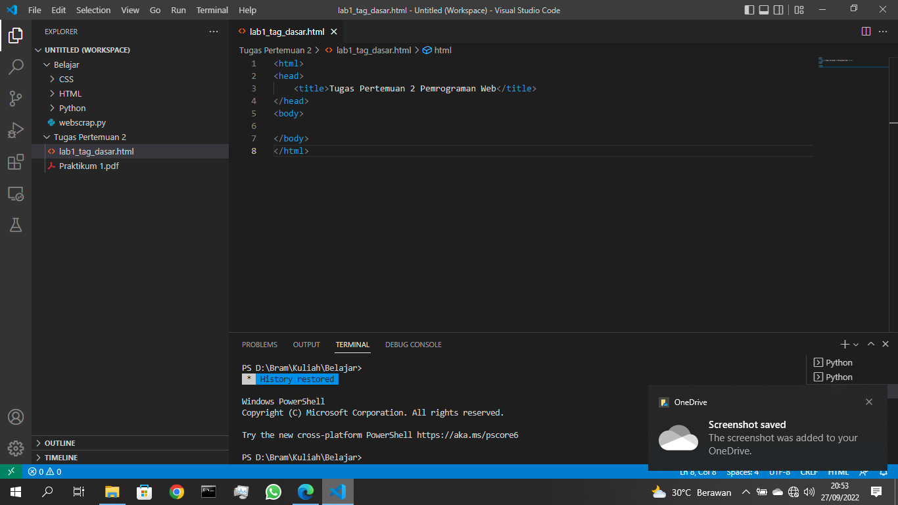
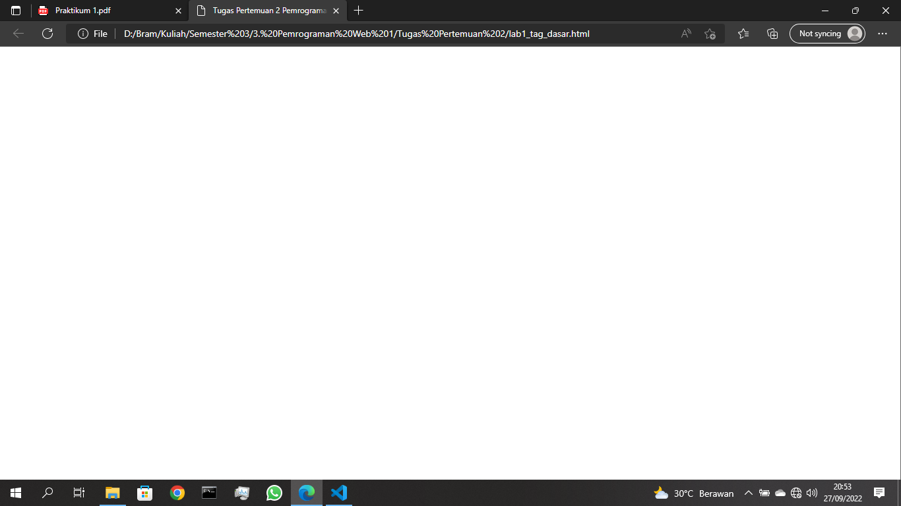
### Tag Paragraf
Untuk membuat paragraf kita dapat memasukan tag p/p 
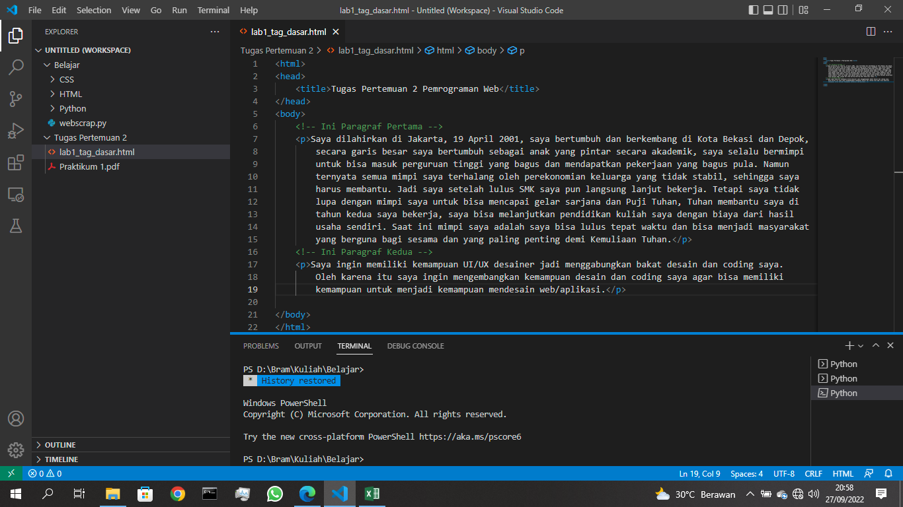
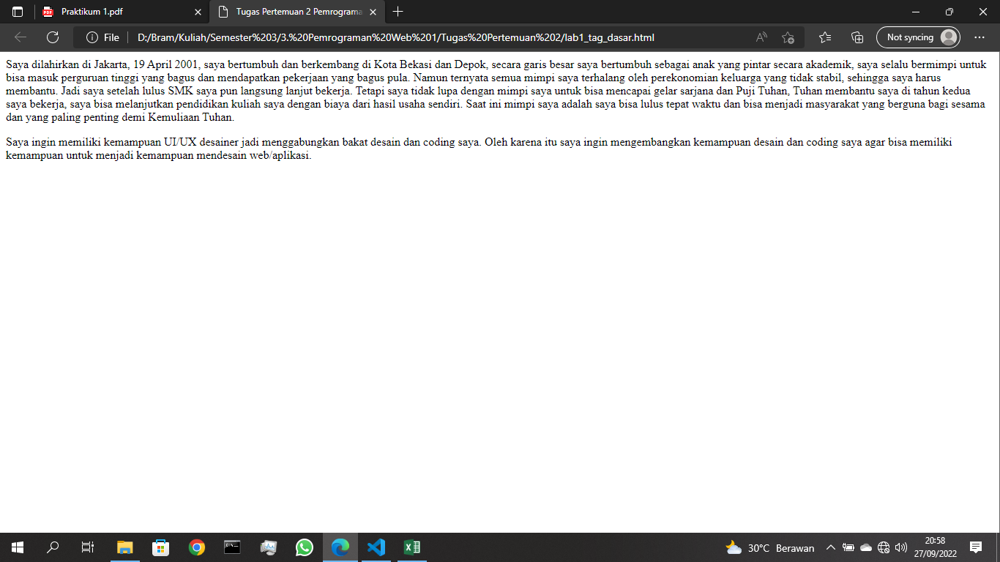
Kita juga dapat mengganti atribut dari sebuah paragraf dengan menambahkan 
atribut align untuk kerataan paragraf
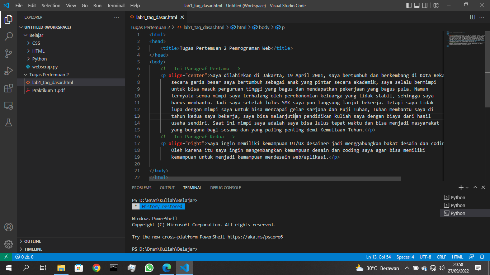
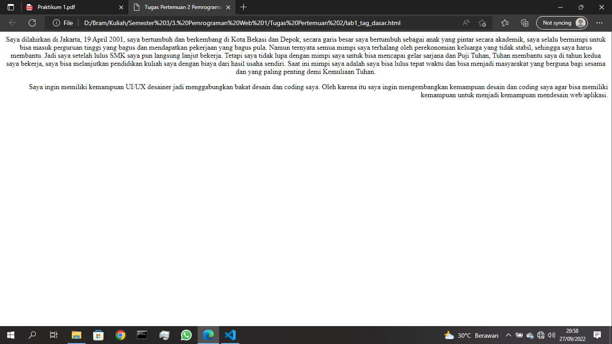
### Tag Judul
Untuk membuat judul kita membuat tag h1/h1 untuk level pertama (paling 
besar sampai h6/h6 level terakhir (paling kecil)
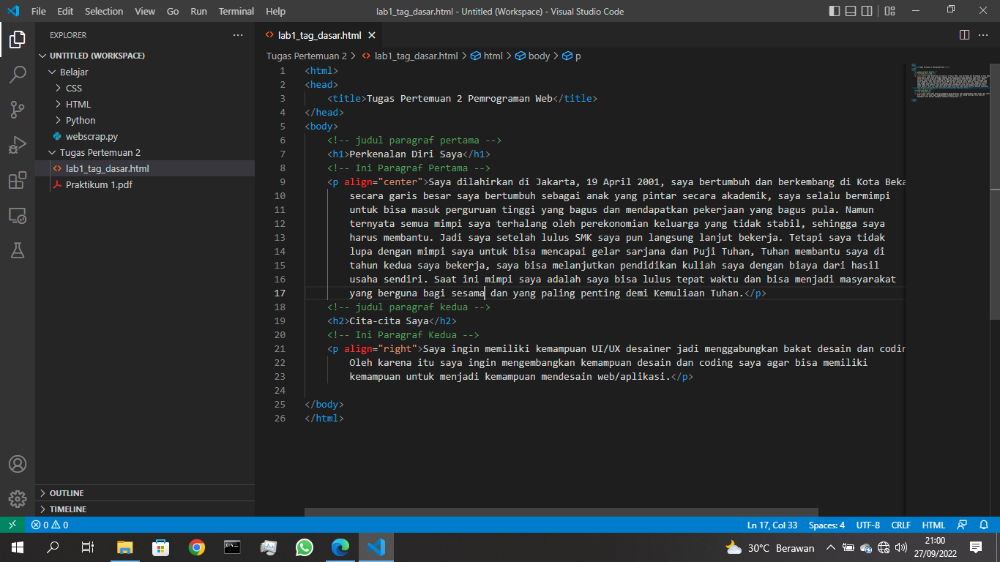
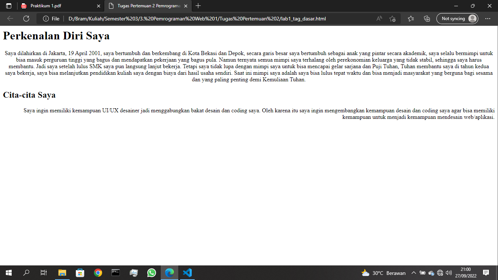
### Cara Memformat Teks
Untuk membuat variasi pada sebuah teks gunakan tag b/b untuk menebalkan 
tulisan; tag i/i untuk memiringkan tulisan; dan lain-lain
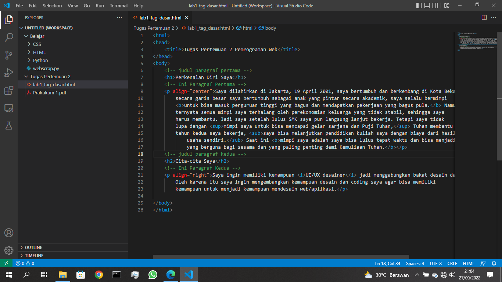
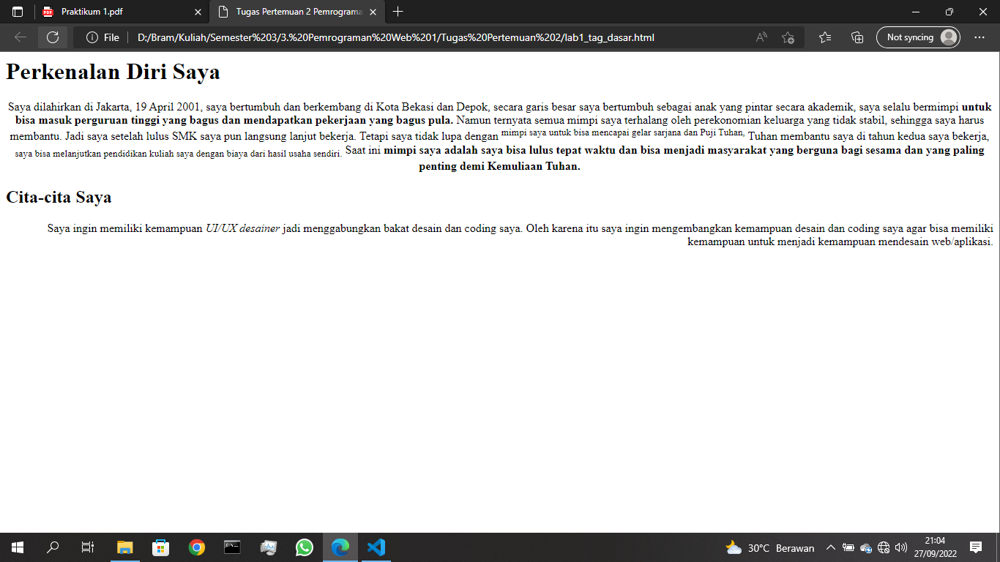
### Tag Gambar
Untuk menambahkan gambar (secara lokal) gunakan tag img src
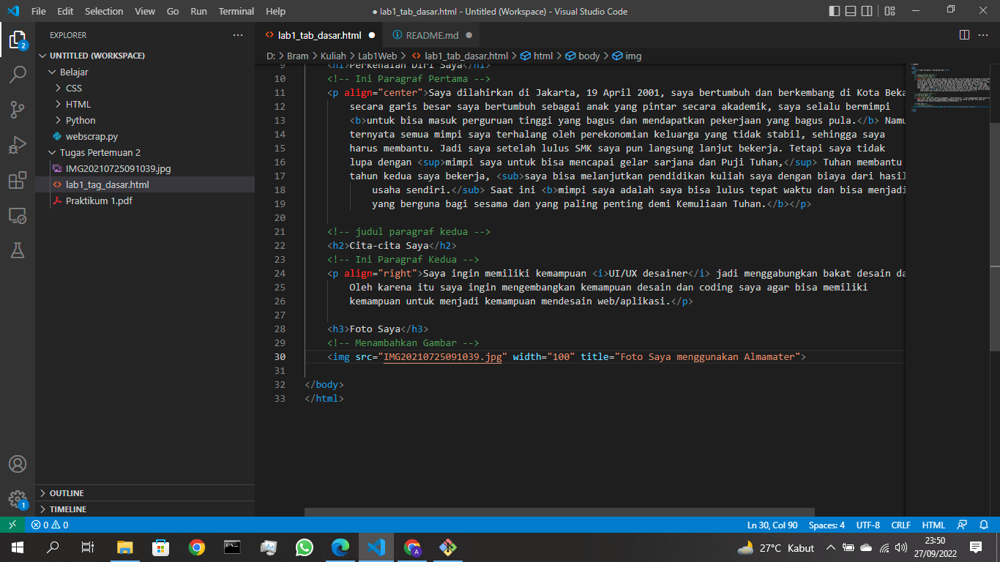
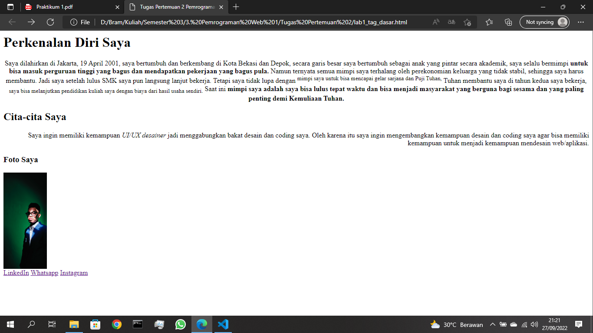
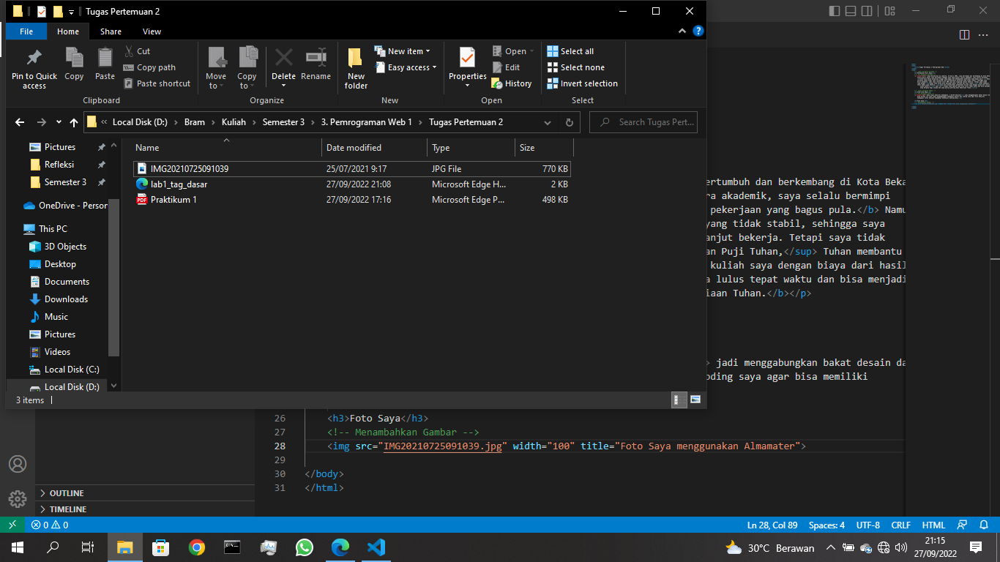
### Tag Link
Untuk menambahkan link haruslah terlebih dahulu menentukan URL apa yang akan 
kita tuju nantinya lalu gunakan tag a href
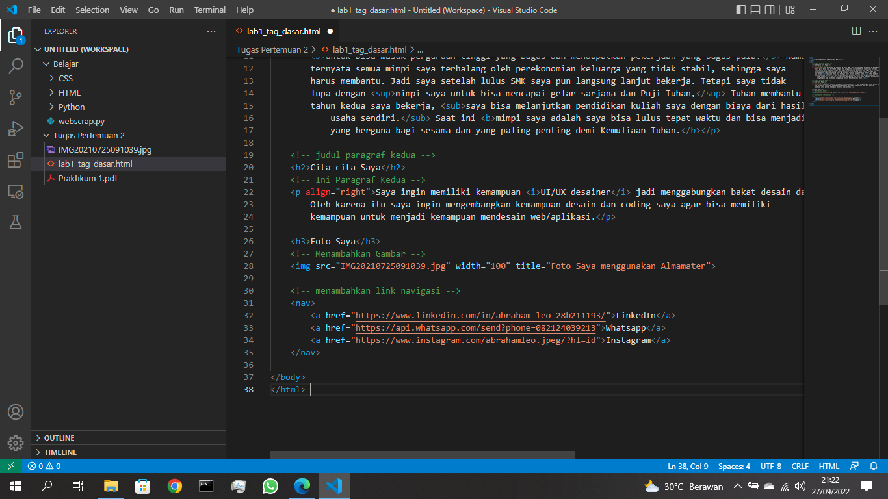
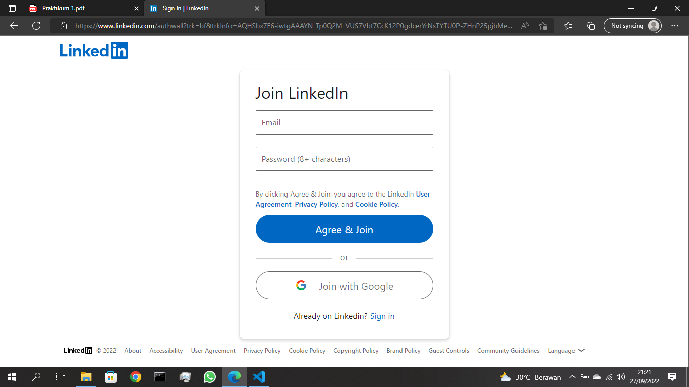
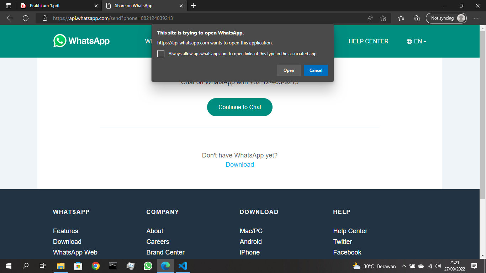
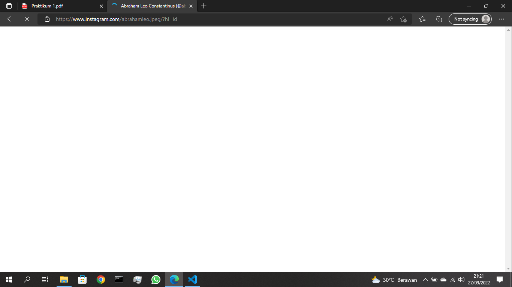